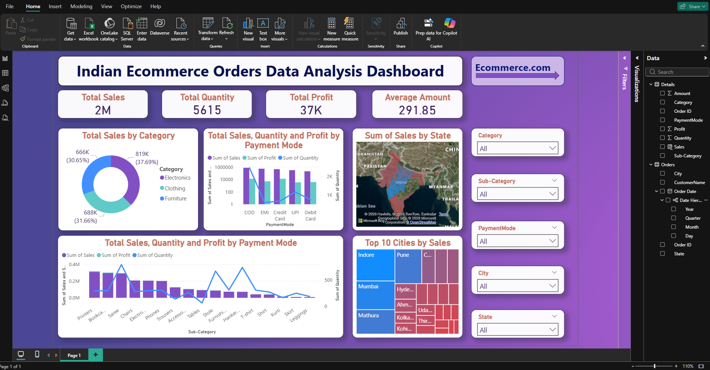

<h1 align="center">📊 Indian Ecommerce Orders Data Analysis Dashboard</h1>

An interactive Power BI dashboard analyzing ecommerce sales performance, customer behavior, and regional trends across India.

<h2>🚀 Live Dashboard</h2>

🔗 <b>View Full Dashboard</b> 
<a href="https://drive.google.com/file/d/1-5RBS6lioHpI1X356QNV9gA0M5fGeFNM/view?usp=sharing" target="_blank">
Open Power BI Dashboard
</a>

<h2>📊 Project Overview</h2>

This project presents an <b>Indian Ecommerce Sales Analytics Dashboard</b> built using Power BI to analyze sales performance across 
categories, payment methods, cities, and states. The dashboard transforms raw ecommerce order data into 
<b>actionable business insights</b> to support data-driven decision making.

<h2>📂 Dataset Summary</h2>

<ul>
<li><b>10,000+ Ecommerce Orders</b></li>
<li><b>5 Product Categories</b></li>
<li><b>20+ Cities</b></li>
<li><b>5 Payment Methods</b></li>
<li>Order, Customer, and Transaction Data</li>
</ul>

<h2>🛠 Tools & Technologies Used</h2>

<ul>
<li><b>Python</b> – Data cleaning and preprocessing</li>
<li><b>MySQL</b> – Data storage and querying</li>
<li><b>Excel</b> – Initial exploration</li>
<li><b>Power BI</b> – Dashboard creation and visualization</li>
</ul>

<h2>📷 Dashboard Preview</h2>

<h2>📈 Key Metrics</h2>

<ul>
<li><b>Total Sales:</b> 2M</li>
<li><b>Total Quantity Sold:</b> 5615</li>
<li><b>Total Profit:</b> 37K</li>
<li><b>Average Order Amount:</b> 291.85</li>
</ul>

<h2>📊 Key Insights</h2>

<ul>
<li>Electronics category generated the <b>highest revenue</b></li>
<li>Cash on Delivery (COD) is the <b>most preferred payment method</b></li>
<li>Top 5 cities contribute a <b>major share of total sales</b></li>
<li>Maharashtra and Madhya Pradesh show <b>highest order volume</b></li>
<li>High-value products drive <b>majority of total profit</b></li>
</ul>

<h2>📊 Dashboard Features</h2>

<h3>1️⃣ Sales by Category</h3>
<ul>
<li>Category-wise revenue comparison</li>
<li>Identify top performing categories</li>
</ul>

<h3>2️⃣ Payment Mode Analysis</h3>
<ul>
<li>Sales by payment method</li>
<li>Profit by payment type</li>
<li>Customer payment preferences</li>
</ul>

<h3>3️⃣ Geographic Analysis</h3>
<ul>
<li>State-wise sales distribution</li>
<li>City-wise revenue contribution</li>
<li>Top performing locations</li>
</ul>

<h3>4️⃣ Product Analysis</h3>
<ul>
<li>Sub-category performance</li>
<li>Top selling products</li>
<li>Quantity vs profit comparison</li>
</ul>

<h2>🎛 Interactive Filters</h2>

<ul>
<li>Category</li>
<li>Sub-Category</li>
<li>Payment Mode</li>
<li>City</li>
<li>State</li>
</ul>

These slicers allow dynamic exploration of ecommerce performance and customer behavior.

<h2>🎯 Business Value</h2>

<ul>
<li>Identify high-performing product categories</li>
<li>Understand customer payment preferences</li>
<li>Analyze regional sales performance</li>
<li>Optimize inventory and product strategy</li>
<li>Support data-driven ecommerce decisions</li>
</ul>

<h2>👨‍💻 Author</h2>

<b>Kuldeep Rathore</b>

🔗 LinkedIn 
<a href="https://www.linkedin.com/in/kuldeeprathore9440">
www.linkedin.com/in/kuldeeprathore9440
</a>

⭐ If you like this project, consider giving the repository a star!

